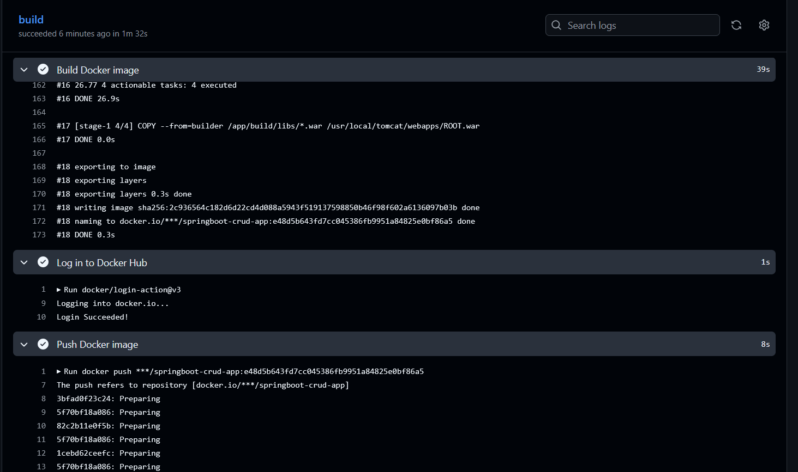
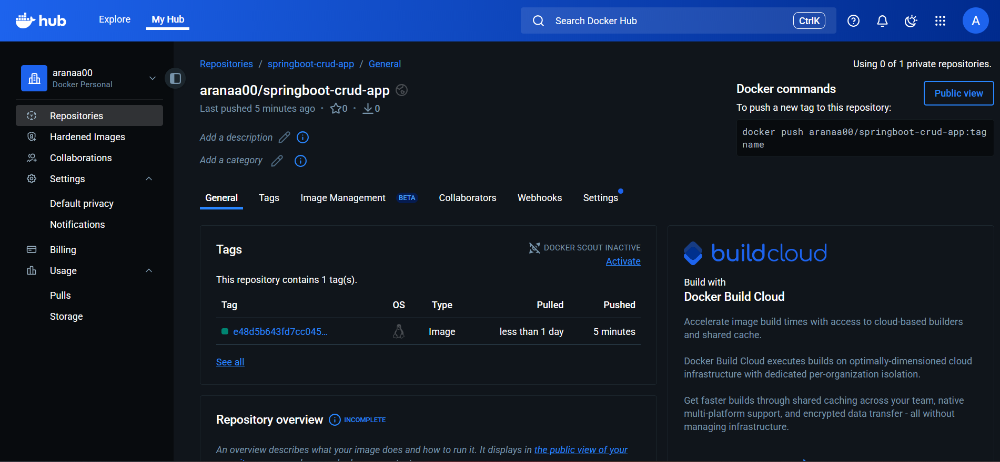
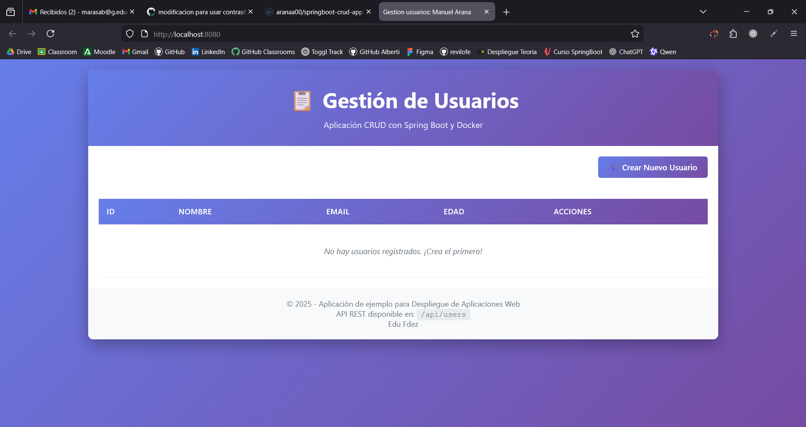
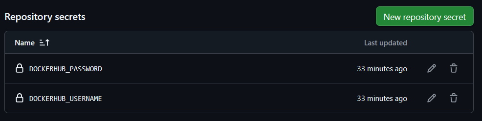

# Cambios Significativos

- Publicación automática de la imagen en Docker Hub.
- Optimización del workflow para simplicidad y buenas prácticas.
- Título de la web cambiado a "Manuel Arana".
- Uso en GitHub de secrets para variables DOCKERHUB_USERNAME y DOCKERHUB_PASSWORD
- Creacion en el directorio raiz /img para guardar las imagenes

# Capturas de Pantalla

Ahora pongo las cpturas para documentar el despliegue:

1. **Workflow exitoso en GitHub Actions**
    

2. **Imagen publicada en Docker Hub**
   

3. **Aplicación funcionando en el navegador**
   

4. **Secrets creados y usados**
   

### Enlace a Docker Hub:
    https://hub.docker.com/repository/docker/aranaa00/springboot-crud-app/general

# Comentario breve sobre docker-publish.yml

El archivo `.github/workflows/docker-publish.yml` automatiza el proceso de:
- Compilar el proyecto con Gradle.
- Construir la imagen Docker.
- Iniciar sesión en Docker Hub usando secretos.
- Publicar la imagen en tu repositorio de Docker Hub.

Este workflow se ejecuta automáticamente en cada push a nuestra rama principal. Pongo trozos de codigo para referenciar que hace cada trocito:

1. **Compilar el proyecto con Gradle**

    https://github.com/Aranaaa00/2526_DAW_u2_springboot/blob/e48d5b643fd7cc045386fb9951a84825e0bf86a5/.github/workflows/docker-publish.yml#L20-L21

2. **Construir la imagen Docker**

    https://github.com/Aranaaa00/2526_DAW_u2_springboot/blob/e48d5b643fd7cc045386fb9951a84825e0bf86a5/.github/workflows/docker-publish.yml#L23-L24

3. **Iniciar sesión en Docker Hub**

    https://github.com/Aranaaa00/2526_DAW_u2_springboot/blob/e48d5b643fd7cc045386fb9951a84825e0bf86a5/.github/workflows/docker-publish.yml#L26-L30

4. **Publicar la imagen en Docker Hub**

    https://github.com/Aranaaa00/2526_DAW_u2_springboot/blob/e48d5b643fd7cc045386fb9951a84825e0bf86a5/.github/workflows/docker-publish.yml#L32-L33

# Log completo de Docker Actions (dividido por secciones)

## Login to Docker Hub
```
Run docker/login-action@v3
Logging into docker.io...
Login Succeeded!
```

## Push Docker Image
```
Run docker push ***/springboot-crud-app:e48d5b643fd7cc045386fb9951a84825e0bf86a5
The push refers to repository [docker.io/***/springboot-crud-app]
3bfad0f23c24: Preparing
5f70bf18a086: Preparing
82c2b11e0f5b: Preparing
5f70bf18a086: Preparing
1cebd62ceefc: Preparing
5f70bf18a086: Preparing
bb3ea38bfd9c: Preparing
db1688142012: Preparing
d03939930dac: Preparing
35c0b8fb11b1: Preparing
d7ef4463791e: Preparing
e8bce0aabd68: Preparing
35c0b8fb11b1: Waiting
d7ef4463791e: Waiting
e8bce0aabd68: Waiting
db1688142012: Waiting
d03939930dac: Waiting
bb3ea38bfd9c: Mounted from library/tomcat
1cebd62ceefc: Mounted from library/tomcat
5f70bf18a086: Mounted from library/tomcat
db1688142012: Mounted from library/tomcat
82c2b11e0f5b: Pushed
d03939930dac: Mounted from library/tomcat
35c0b8fb11b1: Mounted from library/tomcat
d7ef4463791e: Mounted from library/tomcat
e8bce0aabd68: Mounted from library/tomcat
3bfad0f23c24: Pushed
e48d5b643fd7cc045386fb9951a84825e0bf86a5: digest: sha256:fb932435a301ebbd698ac8f6c58762a0eb48b1819afd9b73c726de0bb2d876ee size: 2826
```

## Post log in to Docker Hub
```
Post job cleanup.
/usr/bin/docker logout docker.io
Removing login credentials for docker.io
Post cache
  State not set
```

### Estado funcional COMPLETADO